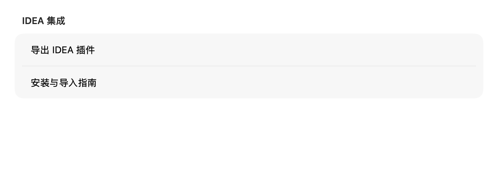
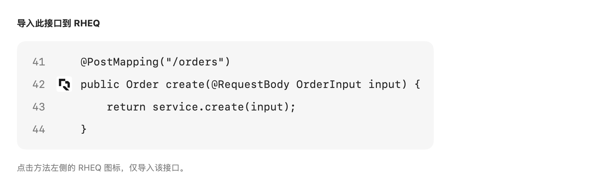
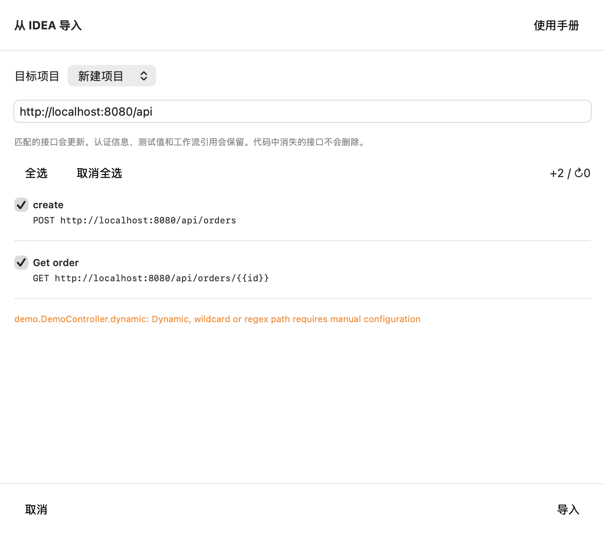

# RHEQ Controller Bridge

从 IDEA 的 Java Spring Controller 生成接口声明，在本机 RHEQ 预览后导入。无需运行后端，无需配置监听端口。插件只读取声明、注解和 DTO 字段，不传送方法实现。预览与导入都不会发送业务接口请求。

## 安装

支持 macOS 上的 IntelliJ IDEA 2026.2，build 262.x，需启用 Java 插件。

1. 在 RHEQ 设置中打开「IDEA 集成」，点击「导出 IDEA 插件」，保存 ZIP。
2. 在 IDEA 打开 Settings → Plugins，点击齿轮菜单 → Install Plugin from Disk。
3. 选择 ZIP，确认安装并重启 IDEA。
4. 等待项目依赖和索引加载完成。



配图由程序界面使用虚构数据直接渲染，不是用户桌面截图。完整说明也在 RHEQ 设置 → 使用手册 → IDEA 集成中。

## 第一次导入

索引完成后，每个支持的 Controller 接口方法左侧都有白底 RHEQ 图标。点击图标即可单独导入所在接口，不需要先把光标移进方法。悬停提示为「导入此接口到 RHEQ」。之后填写基础地址，在 RHEQ 预览确认。



这张图是行侧图标位置示意，实际 IDEA 配色和其他插件图标随你的配置变化。图标未显示时，在 IDEA Settings → Editor → General → Gutter Icons 中启用 RHEQ Interface Import（中文显示为「RHEQ 接口导入」）。索引进行中暂不显示图标。

也可以在 Java Controller 方法内部右键，选择 RHEQ：

| 动作 | 范围 |
| --- | --- |
| 导入当前方法到 RHEQ | 当前带映射注解的方法 |
| 导入 Controller 到 RHEQ | 当前类中的接口方法 |
| 导入模块到 RHEQ | Project 树中选中模块的 Java Controller |

输入实际服务器地址。应用的 `server.servlet.context-path` 需要自己包含在地址中，插件不启动应用，也不推断运行配置。例如基础地址 `http://localhost:8080/api`、Controller 路径 `/orders`、方法路径 `/{id}`，结果为 `http://localhost:8080/api/orders/{{id}}`。

确认接口数量和警告，点击「在 RHEQ 中打开」。RHEQ 展示请求列表，选择新项目或已有本地项目，检查基础地址，取消勾选不需要的接口，再点击「导入」。`+` 表示新增，`↻` 表示将更新匹配请求。



导入后选中请求，填写认证，检查查询参数、请求头和请求体。`{{id}}` 等路径变量可以替换成具体测试值，也可以在当前环境中定义。DTO 示例是占位值，需要核对业务要求。运行自己的后端，准备好后点击「发送」。

## 代码修改后刷新

再次执行同一个 IDEA 动作，选择同一个 RHEQ 项目。插件不会在每次保存代码时自动导入。

- 以项目、模块及接口标识匹配请求，保留原请求 ID 和工作流引用。
- 更新 HTTP 方法。URL 和请求体只有在用户没有修改时才随代码更新。
- 保留认证、已有查询参数值、请求头值和启用状态，新增代码中的参数。
- 保留用户重命名的请求。代码中消失的接口不会自动删除。
- 改类名、方法名、参数类型或顺序，以及移动项目目录或重命名模块，可能产生新的接口标识。人工核对旧请求再处理。
- 多条请求意外关联同一接口时，导入会报错，请先处理重复关联。

导入原始测试值和认证后，不要把它们当作代码声明的一部分。刷新预览中的更新数也包含来源记录发生变化但本地编辑被保留的情况。已关联 OpenAPI 自动同步的项目不能作为目标，避免两种来源同时更新同一项目。

## 解析范围和限制

支持 `@RestController`、`@Controller`、`@RequestMapping`、`@GetMapping`、`@PostMapping`、`@PutMapping`、`@PatchMapping`、`@DeleteMapping`，以及 `@PathVariable`、`@RequestParam`、`@RequestHeader`、`@RequestBody`、`@RequestPart`。支持类与方法路径组合、可解析的 Java 常量、多路径、多 HTTP 方法。无 method 限制的 RequestMapping 展开为 GET、POST、PUT、PATCH、DELETE、HEAD、OPTIONS。

DTO 支持基本类型、数组、List/Set/Collection、Map、Optional、枚举、普通字段与 record 字段，以及部分 Bean Validation 和 Swagger 描述。JSON 请求体包含字段示例；文件参数需要导入后选择实际文件。基础地址、认证和服务返回内容需要自行配置。

Kotlin、自定义映射注解别名、通配符、路径正则和运行时表达式不在自动解析范围内。继承参数注解、映射 params/headers 条件、特殊序列化规则、复杂泛型、非 JSON 请求体和跨模块接口需要核对。接口只来自所选模块的源文件，不扫描整个磁盘。DTO 最多 8 层、每类型 100 个字段；每次最多 2000 个接口、5 MB。大型模块超过 20000 个 Java 文件会停止导出。

## 排查

- **没有 RHEQ 菜单**：确认插件已启用、IDEA 已重启、光标在 Controller 内，等待索引完成。模块导入需要选中具体模块。
- **没有找到接口**：检查 Java/Spring 注解依赖是否解析成功。检查目标是否是源代码 Controller，而不是 Kotlin 或依赖 JAR。
- **RHEQ 未打开**：确认 `/Applications/RHEQ.app` 存在，查看 IDEA 的错误信息。插件将导出保存在 IDEA 系统缓存目录的 `rheq-exports` 下，扩展名为 `.rheqapi`。可通过 RHEQ 原有「导入项目」文件选择器选择该文件。
- **地址少了一段**：把网关前缀或应用 context-path 补进基础地址。Java 包名不是 URL 前缀。
- **发送时缺少变量**：定义环境里的 `id` 等变量，或在请求地址中填具体值。
- **刷新后出现新请求**：检查是否换了目标项目、模块名、工程路径、方法名或参数签名。

## 本地构建与验证

```sh
python3 idea-plugin/build.py
python3 idea-plugin/verify_package.py
TZ=UTC python3 idea-plugin/test.py
```

构建使用本机 IDEA 的 JBR 和 SDK，不打包 JetBrains 库。`test.py` 使用独立临时工程、配置、缓存和插件目录，在无界面 IDEA 进程中验证三种范围、参数、常量路径、DTO、动态路径警告和动作注册，不控制鼠标键盘，不写入用户项目。生产包不包含测试启动器。

源代码遵循仓库的 [LICENSE.md](../LICENSE.md)。本目录没有执行 Marketplace 发布。
